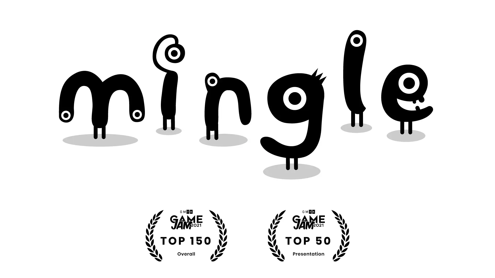
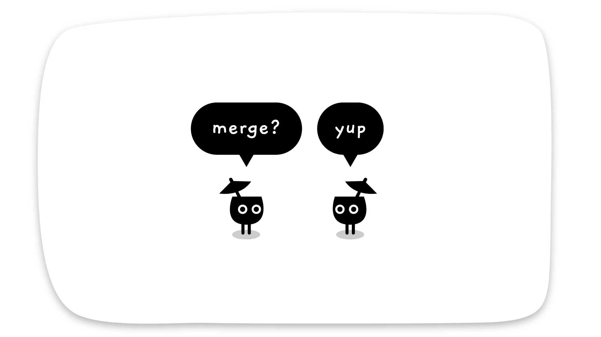
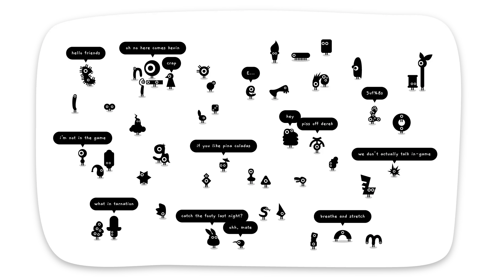

# Mingle Game

> Find your perfect match in Mingle Game, a cute puzzle game with 50 characters! Enjoy 4-10 min of fun merging minglers in this charming experience. 

## About Mingle Game

[Mingle Game](https://minglegame.store/) is a fun and interactive social experience designed to bring people together. Whether you're at a party, a corporate event, or a get-together with friends, Mingle Game offers engaging activities and icebreakers that encourage communication and connection. Perfect for all ages, it fosters teamwork and laughter, making every gathering memorable. Discover the joys of mingling and strengthen your social bonds with Mingle Game.

## Key Features of Mingle Game

### 🎮 Find your perfect match in the crowd.

### 🎭 Match and merge minglers.

### 🎨 Repeat until they're all joined together.

### 🎵 50 unique playable characters.
Playtime of 4 - 10 minutes.
Created in 48 hours for the GMTK 2021 Game Jam.
Ranked 131 out of 5,800 entries.

## Game Features

- **Customizable Protagonist**: Personalize your character's appearance and attributes
- **Dynamic Character Interactions**: Engage with evolving character personalities
- **Progress Tracking**: Monitor achievements and collectibles
- **Multiple Endings**: Different outcomes based on your choices
- **Puzzle Elements**: Various minigames and puzzles to solve
- **Achievement System**: 26 unique achievements to unlock

