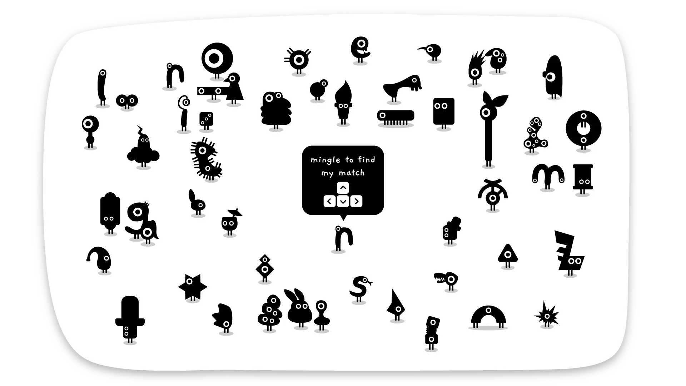
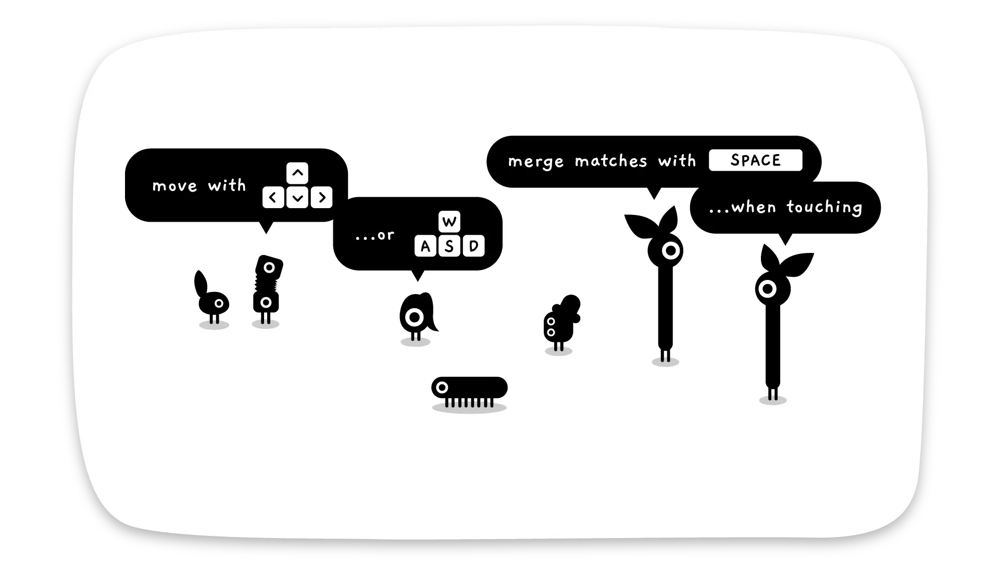
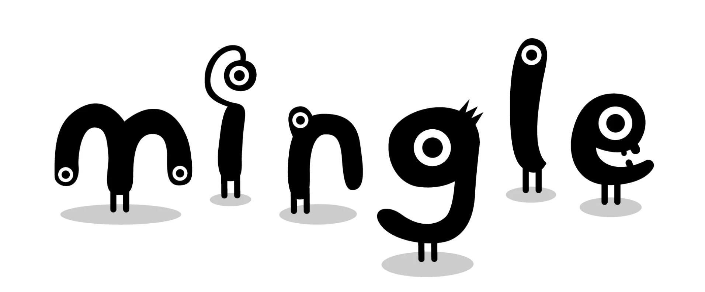

# Mingle Game

> Find your perfect match in Mingle Game, a cute puzzle game with 50 characters! Enjoy 4-10 min of fun merging minglers in this charming experience. 

## About Mingle Game

[Mingle Game](https://minglegame.store/) is a fun and interactive social experience designed to bring people together. Whether you're at a party, a corporate event, or a get-together with friends, Mingle Game offers engaging activities and icebreakers that encourage communication and connection. Perfect for all ages, it fosters teamwork and laughter, making every gathering memorable. Discover the joys of mingling and strengthen your social bonds with Mingle Game.

## Key Features of Mingle Game

### 🎮 Adventure Horror Gameplay
- Explore dark rooms and environments
- Interact with objects and search for clues
- Avoid dangers, including being stalked by unhinged characters
- Engage with various minigames and puzzles scattered throughout

### 🎭 Rich Storytelling
- Multiple endings based on your choices
- Dynamic character interactions, especially with Mita
- Psychological and supernatural horror elements
- Choice-driven progression affecting storyline outcomes

### 🎨 Unique Visual Style
- Distinctive art style with 3D graphics
- Anime-inspired visuals contrasting with horror themes
- Customizable protagonist appearance
- Carefully crafted environments

### 🎵 Immersive Audio
- Atmospheric sound design
- Voice acting support (currently in Russian)
- Soundtrack transitions from warm melodies to eerie ambient sounds
- Audio cues enhancing the horror experience

## Game Features

- **Customizable Protagonist**: Personalize your character's appearance and attributes
- **Dynamic Character Interactions**: Engage with evolving character personalities
- **Progress Tracking**: Monitor achievements and collectibles
- **Multiple Endings**: Different outcomes based on your choices
- **Puzzle Elements**: Various minigames and puzzles to solve
- **Achievement System**: 26 unique achievements to unlock

